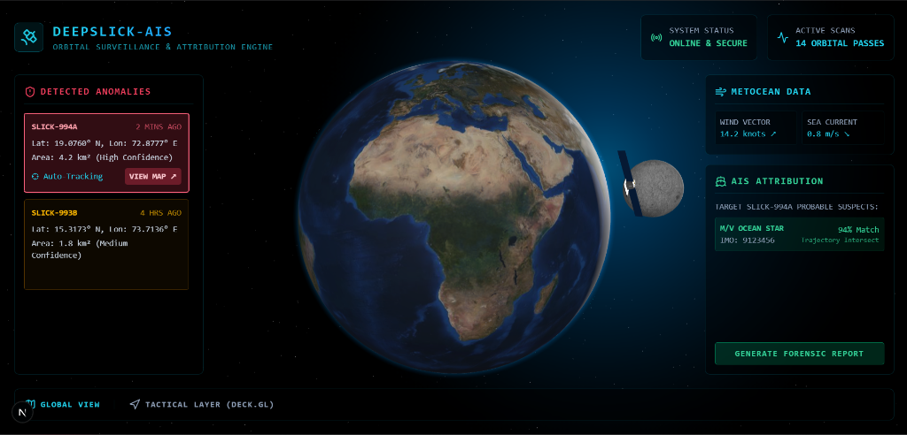

# 🛰️ DeepSlick-AIS

**Orbital Surveillance & Forensic Attribution Engine for Marine Oil Spills**



DeepSlick-AIS is an autonomous marine surveillance platform designed to combat illegal ocean dumping. By combining space-based radar, advanced hydrodynamic drift modeling, and maritime tracking data, the system not only detects oil spills but mathematically traces them back to the exact responsible vessel.

---

## 🌊 The Problem
Illegal bilge dumping and oil spills happen frequently at sea, causing devastating ecological damage. Because the oceans are vast, the evidence disperses quickly, and by the time a slick is discovered, the perpetrator is usually hundreds of miles away. 

## 🚀 The Solution
DeepSlick-AIS introduces **attribution** to spill tracking through a three-stage forensic pipeline:

1. **SAR Satellite Segmentation:** Ingests Sentinel-1/ICEYE Synthetic Aperture Radar (SAR) imagery to autonomously detect and map oil slicks, regardless of cloud cover or darkness.
2. **Lagrangian Drift Engine:** Utilizes MetOcean data (wind and sea currents) and a 4th-order Runge-Kutta (RK4) integrator to run a **Hindcast**—modeling the oil's drift backward in time to pinpoint the initial discharge origin. It also runs a **Forecast** to predict future coastal impacts.
3. **AIS Trajectory Correlation:** Cross-references the hindcasted origin window against historical Automatic Identification System (AIS) maritime data, flagging the specific suspect vessel whose trajectory intersects the spill origin.

All data is visualized in a high-performance, hardware-accelerated 3D tactical dashboard built for Coast Guards and Environmental Protection Agencies.

---

## 🛠️ Technology Stack

**Frontend (Mission Control):**
* [Next.js 16](https://nextjs.org/) & React
* [Deck.gl](https://deck.gl/) & [React-Map-GL](https://visgl.github.io/react-map-gl/) (Hardware-accelerated geospatial visualization)
* [Three.js](https://threejs.org/) (Custom 3D orbital background & satellites)
* [Tailwind CSS](https://tailwindcss.com/) (Cyber/Tactical UI styling)

**Backend (Drift Engine & Analytics):**
* [FastAPI](https://fastapi.tiangolo.com/) (High-performance Python API)
* [SciPy](https://scipy.org/) & [NumPy](https://numpy.org/) (Runge-Kutta hydrodynamic integration)
* [Shapely](https://shapely.readthedocs.io/) (Geospatial geometry processing)

---

## ⚙️ Getting Started

### Prerequisites
* Node.js (v18+)
* Python (3.9+)

### 1. Start the Backend
```bash
cd backend
python -m venv venv
# Windows: venv\Scripts\activate | Mac/Linux: source venv/bin/activate
pip install -r requirements.txt
python -m uvicorn main:app --reload --port 8000
```
*The backend API will run on `http://localhost:8000`*

### 2. Start the Frontend
```bash
cd frontend
npm install
npm run dev
```
*The tactical dashboard will be available at `http://localhost:3000`*

---

## 💻 How to Use the System

Once both the backend and frontend servers are running on your device:

1. **Access the Dashboard:** Open your web browser and navigate to `http://localhost:3000`. You will be greeted by the Orbital Surveillance Dashboard and a 3D Earth view.
2. **Enter Tactical Mode:** Click the **Tactical Layer (Deck.gl)** button in the bottom left footer to switch from the global view to the tactical map interface.
3. **Select an Incident:** You will see active incidents listed on the left panel (e.g., `SLICK-994A` or `SLICK-993B`). Click on an incident to fetch its specific SAR geometry and AIS tracking logs from the backend.
4. **Run the Forensic Drift Engine:**
   - Use the **Source Trace (Hindcast)** slider at the bottom. Scrub it backward (-36h to 0) to visualize the oil particles' estimated past trajectories and see exactly when and where they intersect with suspect vessels in the area.
   - Use the **Drift Forecast** slider to project the oil spill forward in time (+36h) to predict coastal impact zones.
5. **Analyze Suspects:** Hover over the colored trajectory lines of ships on the map to view their MMSI, type, and speed at that exact timestamp. The ship whose path intersects the slick's origin point at the `-36H` timestamp is flagged as the primary suspect.

---

## 🏆 Smart India Hackathon 2026
This project was developed for the Smart India Hackathon (SIH) 2026. 
* **Theme:** Disaster Management
* **Category:** Software

---
*DeepSlick-AIS - Holding polluters accountable from orbit.*
